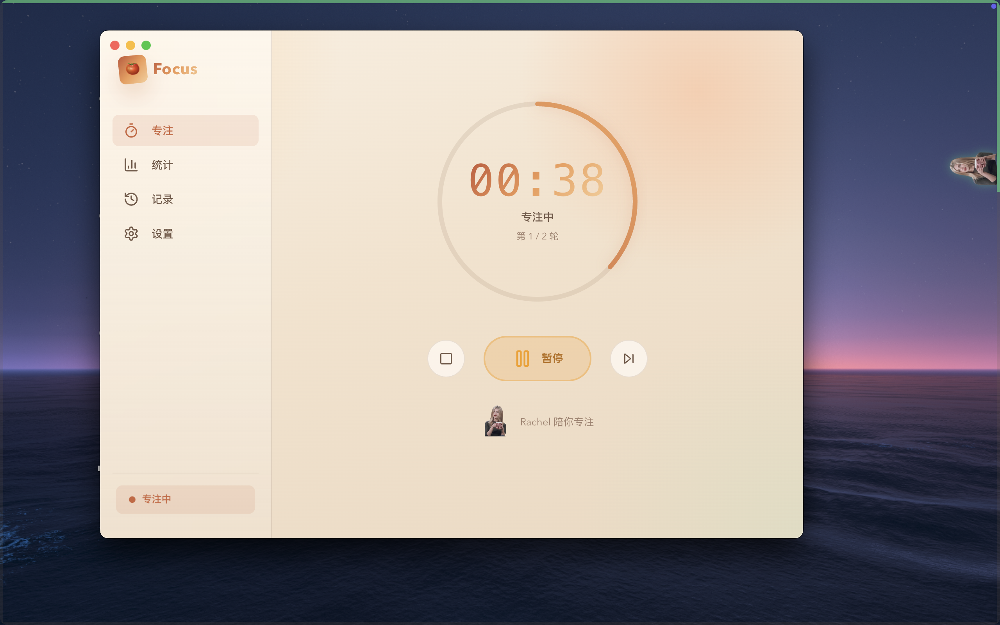
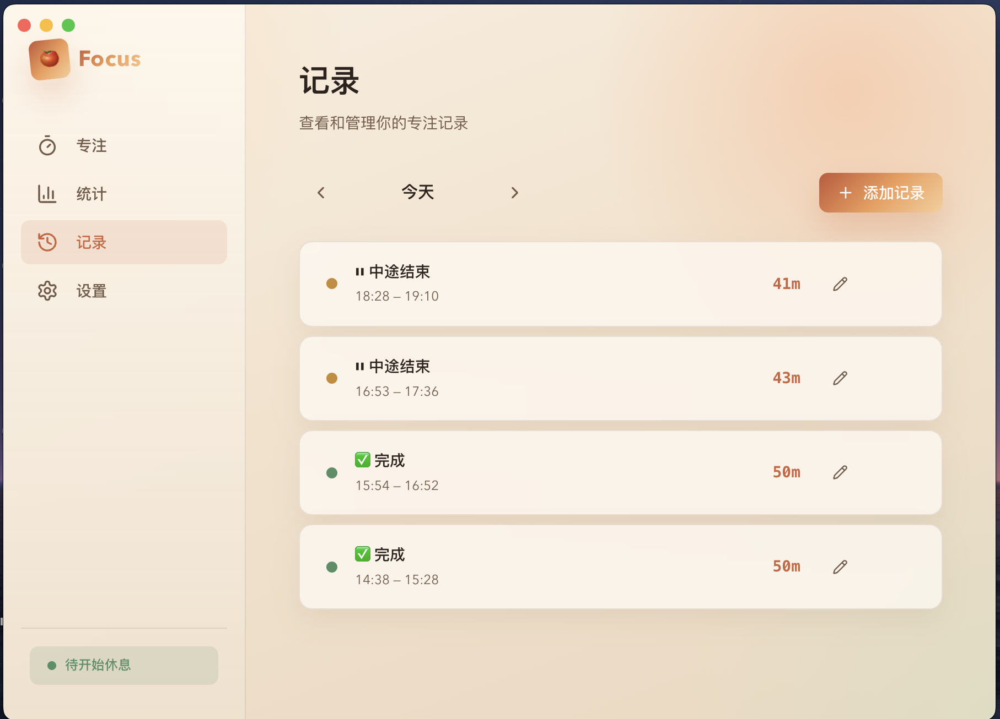
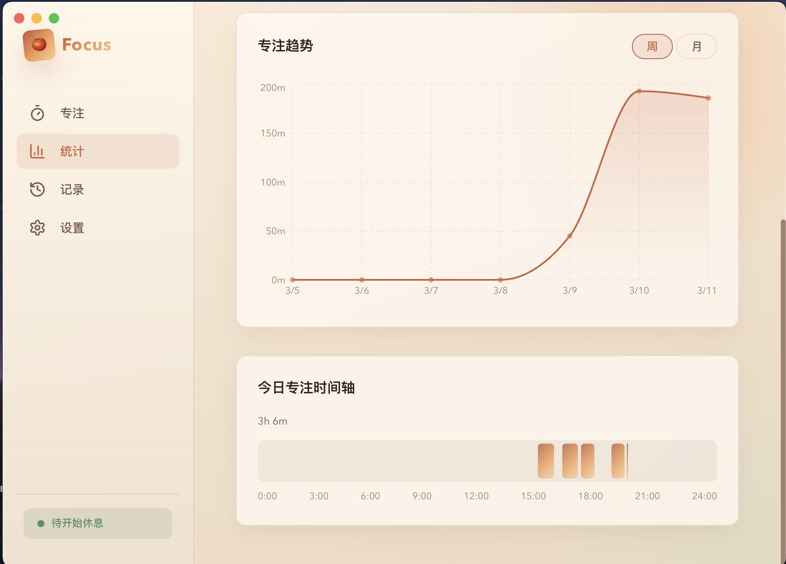

# Focus

Focus 是一款macOS的桌面级番茄钟与专注软件，旨在通过沉浸式的专注体验和动态可爱的桌面人偶陪伴，帮助你保持高效与自律。

## 特性 (Features)

- **核心番茄钟**: 自定义专注与休息时长，支持长休息策略。
- **桌面级悬浮人偶**: 专注期间自动浮现的可爱悬浮宠物在屏幕边缘陪伴你。
- **自适应休息提醒**: 当专注时间结束时，提供全屏磨砂质感弹窗提醒。
- **精准时间轴与统计**: 数据持久化，能够查阅每天真实有效的专注历史和分布时间轴。
- **智能离开检测 (Idle Tracking)**: 监听系统休眠、锁屏或鼠标键盘静置自动剥离未专注时间，重新活跃时无缝恢复。
- **个性化设置**:
  - 支持自定义上传 Mascot 皮肤 (如 SVG 或 PNG)
  - 随意变更悬浮人偶的尺寸和呈现形式
  - 自定义快捷键快速唤起/收起面板 (如 `Cmd+Shift+F`)

## 预览 (Preview)






## 快速开始 (Getting Started)

### 环境依赖
确保你已安装:
- [Node.js](https://nodejs.org/) (建议版本 v18+)
- [npm](https://www.npmjs.com/) 或 `yarn`, `pnpm`

### 安装与运行

1. **克隆项目**:
   ```bash
   git clone https://github.com/doubleyl/focus.git
   cd focus
   ```

2. **安装依赖**:
   ```bash
   npm install
   ```

3. **开发模式运行**:
   启动包含热更新支持的 Electron 开发应用。
   ```bash
   npm run dev
   ```

4. **生产构建打包**:
   打包为可分发的平台执行文件（Mac将生成 `.dmg` 和 `.app`，Windows 生成 `.exe`）。
   ```bash
   npm run build
   ```

## 架构说明

项目采用了基于 Vite 和 React 的现代化 Electron 开发模板：
- **`/electron`**: 主进程 (Main Process) 源码，负责窗口管理、托盘、系统休眠监听与全局快捷键管理等。
- **`/src`**: 渲染进程 (Renderer Process) 源码，使用 React 编写的番茄钟核心界面。
- **`/shared`**: 主进程与渲染进程共享的数据类型与常量定义。

## 隐私声明与用户数据
所有专注记录、个性化配置及自定义上传的皮肤都会持久化静默储存在您的设备本地。本应用不包含任何云同步逻辑，不会上传任何数据。
> 默认存储路径视操作系统而定，一般位于 `~/Library/Application Support/focus` (macOS) 或 `%APPDATA%/focus` (Windows)。

## 开源协议
本项目采用 [MIT License](LICENSE) 许可，你可以自由地修改分发。
